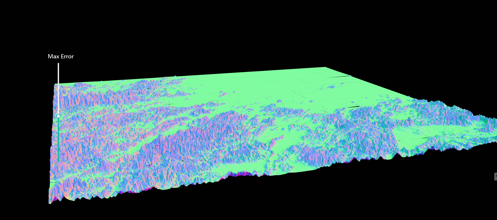

## Setup
Download [Node.js](https://nodejs.org/en/download/).
Run this followed commands:

``` bash
# Install dependencies (only the first time)
npm install

# Run the local server at localhost:8080
npm run dev

# Build for production in the dist/ directory
npm run build
```

Martini算法在地形上的应用，使用threejs实现并展示




todo:根据视口变化，渲染对应的瓦片(地图渲染原理)，根据图片离镜头的距离设置地形不同的maxerror